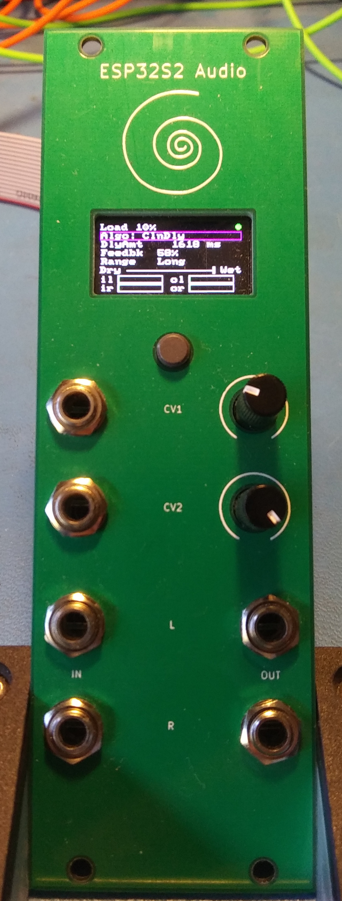
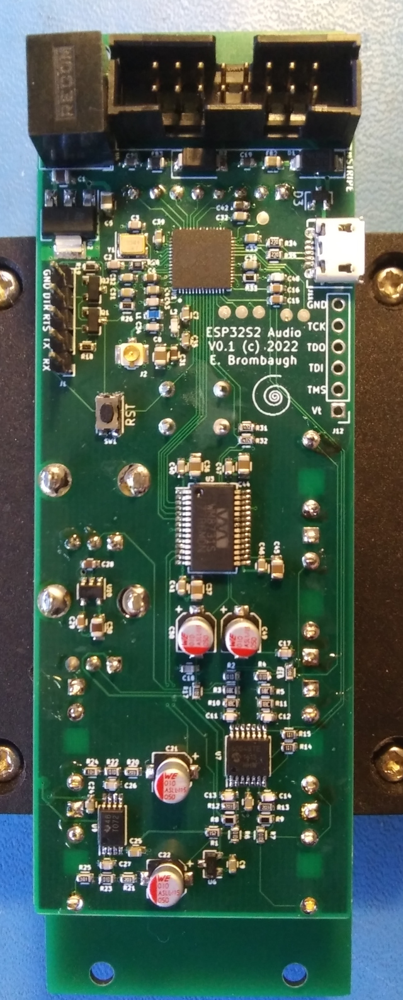

# ESP32S2_Audio
A Eurorack module demonstrating the use of the ESP32S2 as an audio effects processor

  

## Abstract
Blah Blah Blah 2020 Microcontroller shortage. See my RP2040_Audio project
if you really want to read all my whinging about this topic:

https://github.com/emeb/RP2040_Audio

So yeah - I've been using STM32 for so long that I was ignoring all this other
stuff that was coming out, including these nifty IoT SoCs (more TLAS pls!) that
so many folks have been using for the lst few years. Espressif has quite a
family of them with a wide variety of capabilities. The ESP32-S2FN4R2 is
especially interesting because it's got 4MB flash and 2MB PSRAM included in
the package and the price is only a few cents more than the raw part. So I
grabbed some devboards, did proof-of-concept on a breadboard and started a
new hardware design. This one is remarkably similar to the RP2040 project
mentioned above - basically I lifted the entire circuit, layout and all and
then proceeded to jack it up on the grease rack and swap the engine out. Here's
the result.

This project is a feasibility study of using the ESP32S2 MCU as an audio effects
processor, with particular emphasis on performance with challenging DSP.

## Hardware
The complete design consists of two PCBs:
* The system PCB - a single board containg all electrical components. Find it
in the Hardware directory.
* The Front Panel - a PCB-based front panel that conforms to the Eurorack
physical mounting standard. Found in the Hardware/esp32s2_panel directory.

The system PCB has the following features:
* Standard Eurorack 16-pin shrouded power connector
* Two +/-5V CV inputs and associated analog signal conditioning 
* Two +/-7V Audio inputs and associated analog signal conditioning 
* Two +/-7V Audio outputs and associated analog drivers
* WM8731 stereo audio codec
* ESP32S2 with 4MB SPI flash, 2MB PSRAM, USB, JTAG and serial interfaces for
development. The RF antenna connection is also available for playing with WiFi
if I ever get around to it.
* 160 x 80 IPS LCD
* UI button

## Firmware
A demonstration firmware is included that exercises all of the capabilities of
the system, including the LCD, UI button, CV inputs and stereo audio I/O. It is
a basic multi-effects unit that supports a complement of audio DSP algorithms
that are easily extended by adding standardized modules to a data structure.
As provided here just three algorithms are available:
* Simple pass-thru with no processing
* Simple gain control
* Basic "clean delay" with crossfaded deglitching during delay changes.

Other algorithms have been tested including phasers, flangers, frequency shifters,
resampling delays and reverbs, but these are not publicly released at this time.

## Findings
The ESP32S2 is not bad for doing audio, but I found it necessary to do a bit of
hacking on their I2S driver - as delivered in their ESP-IDF V5.0 which I used
here the driver makes some limiting assumptions about how you want to do audio:
Namely that you'll be streaming large buffers to/from some external device like
the WiFi interface or storage. That's *NOT* how I do audio - I want small
buffers streaming in realtime with lots of DSP involved. Consequently, I coded
up a "low-latency" driver that works more the way I want and that's included
here.

The ESP32 ADCs are also noisy and a bit weird to use, so my ADC driver has a
rather kludgy approach to collecting data and applies heavy filtering to clean
things up. The lack of hardware floating point was a bit of a stumbling block
and I spent some time converting a few of my algorithms to work with fixed
point. A few others were fine using floating point in software so those were
left alone. The reasonably large PSRAM works well for smaller-sized buffers
in audio delays and found a lot of use in delays.

I found many other aspects of their system quite pleasant to use - the IDF has
a lot of well thought-out services, and the build process is easy to work with.

TL;DR - ESP32S2 can work well for audio effects. Give it a try!
